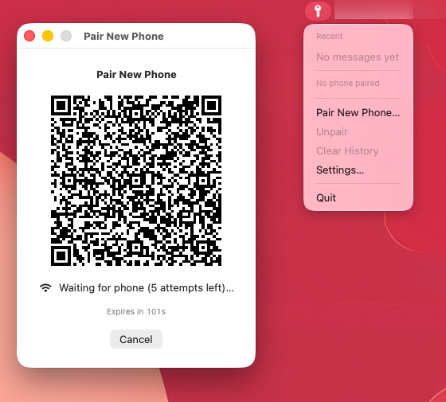
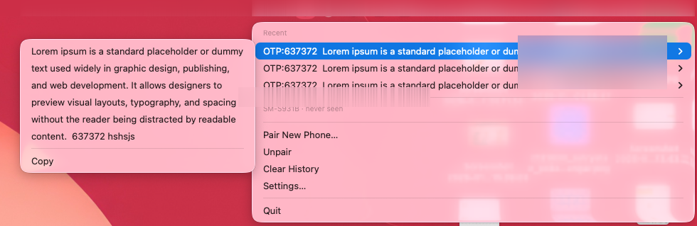
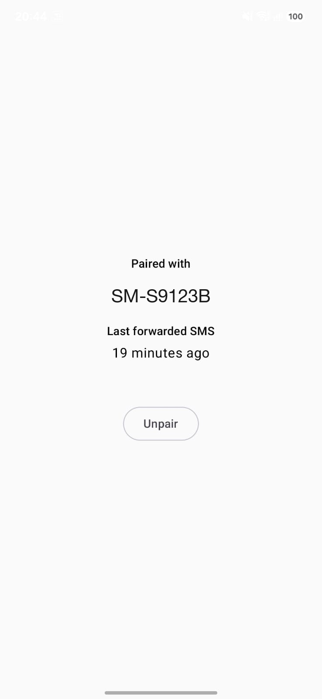

# clipy-sms

A personal SMS forwarder: an Android phone forwards incoming SMS (OTPs, mostly) over the LAN to
a Mac, where they show up in a menu bar app you can copy from — no cloud, no accounts, no
third-party server in the middle.

Every message is end-to-end encrypted between the phone and the Mac (ECDH P-256 + HKDF +
AES-256-GCM), derived from a one-time QR-code pairing. The wire protocol is fully specified in
[`in-sms/docs/PROTOCOL.md`](in-sms/docs/PROTOCOL.md) so the two sides can be (and were) built
independently.

## Components

| | |
|---|---|
| **[`in-sms/`](in-sms)** | macOS receiver: a Go background daemon (`otpd`) handling networking/crypto/storage, plus a SwiftUI menu bar app for the UI. |
| **[`out-sms/`](out-sms)** | Android sender: a Kotlin/Compose app that reads incoming SMS and forwards them, encrypted, to a paired Mac. |

Each has its own docs and its own working style; start with whichever side you're touching:

- `in-sms/README.md` — running, debugging, autostart, IPC socket cheatsheet
- `in-sms/docs/PROTOCOL.md` — the wire protocol (binding for both sides)
- `in-sms/docs/ARCHITECTURE.md` — Mac-side design
- `out-sms/docs/DESIGN.md` — Android-side design

## How it works, briefly

1. The Mac generates a P-256 keypair and a one-time pairing token, shown as a QR code.
2. The phone scans it, generates its own keypair, and exchanges public keys with the Mac over
   `POST /v1/pair` — both sides derive the same session keys via ECDH + HKDF-SHA256.
3. Every forwarded SMS is sent as an AES-256-GCM-encrypted envelope to `POST /v1/msg`, validated
   for replay/counter/timestamp, and shown in the Mac's menu bar.

No message content, key material, or pairing token ever touches a server outside the LAN.

## Screenshots

| Pairing | Menu | Android |
|---|---|---|
|  |  |  |

## Status

- **Mac side (`in-sms/`)**: functional end-to-end — daemon, pairing, message path, storage,
  menu bar UI, and an autostart setup. Not yet packaged as a signed `.app` (still run via
  `go run`/`swift run`/`launchd`, not the App Store or a `.dmg`).
- **Android side (`out-sms/`)**: functional end-to-end — pairing, QR scanning, and encrypted
  message forwarding are implemented and unit tested. Not yet done: a signed release build and
  broader real-network end-to-end verification.

## Repo layout

```
in-sms/     Go daemon + SwiftUI app (macOS)
out-sms/    Kotlin/Compose app (Android)
```
